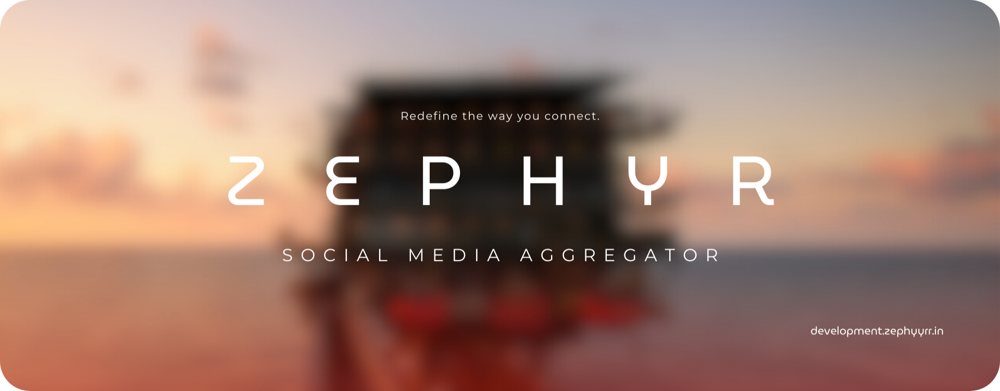
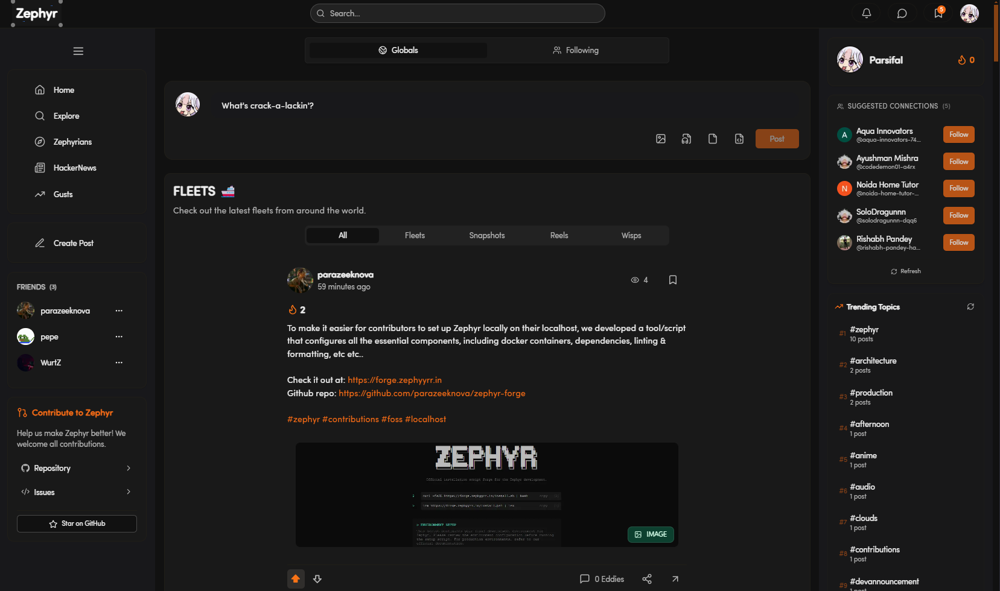
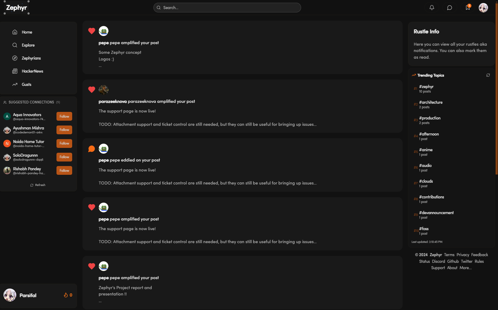
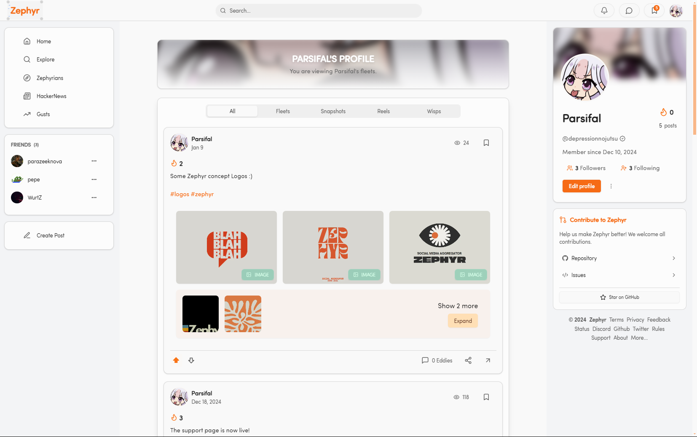
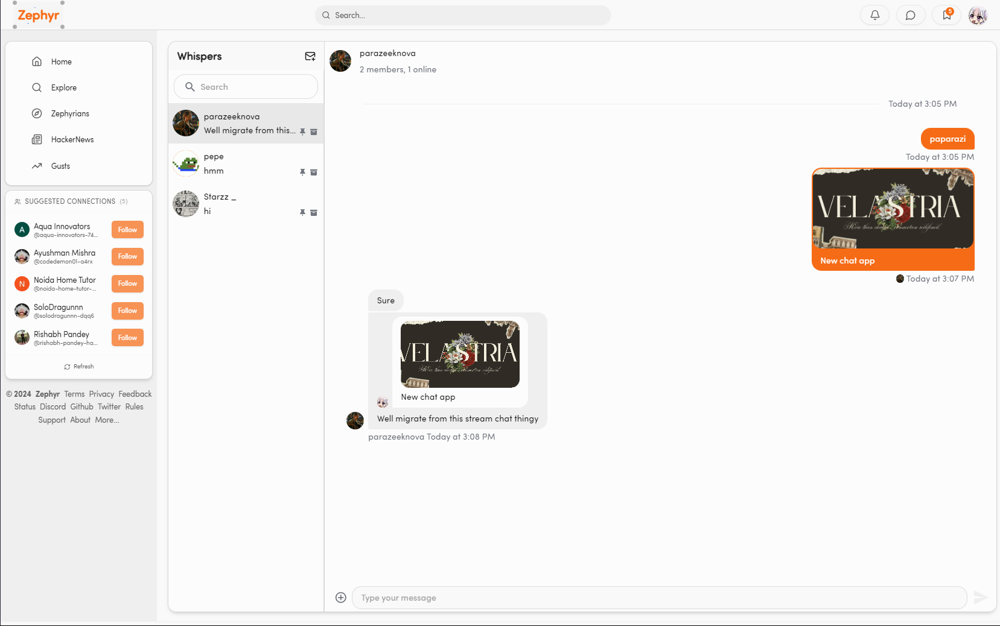
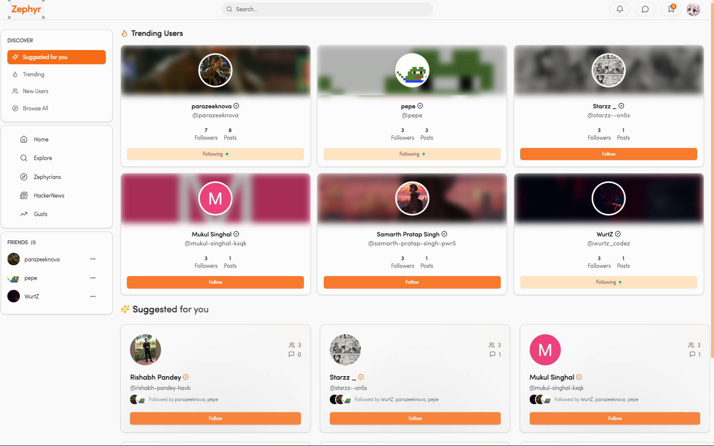

<div align="center">

  <a href="https://github.com/parazeeknova/zephyr">
    
  </a>
</div>

<br>
<br>

<div align="center">
  
  <a href="#-local-development-setup"><kbd> <br> Development <br> </kbd></a>&ensp;&ensp;
  <a href="https://github.com/parazeeknova/zephyr/blob/main/.github/CONTRIBUTING.md"><kbd> <br> Contributing <br> </kbd></a>&ensp;&ensp;
  <a href="https://github.com/parazeeknova/zephyr/wiki"><kbd> <br> Wiki <br> </kbd></a>&ensp;&ensp;
  <a href="https://github.com/parazeeknova/zephyr/issues"><kbd> <br> Roadmap <br> </kbd></a>&ensp;&ensp;
    <a href="#-screenshots"><kbd> <br> Screenshots <br> </kbd></a>&ensp;&ensp;
  <a href="#-troubleshooting"><kbd> <br> Troubleshoot <br> </kbd></a>&ensp;&ensp;

</div>

#### _<div align="left"><sub>// Project Overview</sub></div>_

<p align="left">
<strong>Zephyr</strong> is a Social aggregator, part social media platform, part news aggregator. It is a platform that allows users to share and discover content from around the web. Completly open-source and community-driven, Zephyr is a platform that is built by the community, for the community.
</p>

#### _<div align="left"><sub>// Sub-services under Zephyr</sub></div>_

<div align="center">

<p>
  <a href="https://share.zephyyrr.in/s/repo"><strong>Zephyr Services (GITEA)</strong></a> | 
  <a href="https://development.zephyyrr.in/support"><strong>Zephyr Support</strong></a> | 
  <a href="https://github.com/parazeeknova/velastria"><strong>Velastria / Zephyr chat</strong></a> | 
  <a href="https://github.com/parazeeknova/zephyr-forge"><strong>Zephyr Forge</strong></a>
</p>

</div>

#### _<div align="left"><sub>// Local Development Setup</sub></div>_

> [!NOTE]
> **Note for SWOC contributors**: Zephyr is a large project with multiple services and dependencies. The Issues page containes list of issues that may or may not be suitable for SWOC contributions. Check ISSUES with `SWOC` label for issues that are suitable for SWOC contributions. If you are unsure about the issue, feel free to ask in the issue thread. You can also create a new issue with `SWOC` label for any feature or bug you want to work on.

###### _<div align="left"><sub>// Prerequisites</sub></div>_

<p align="center">
  <a href="https://nodejs.org/">Node.js</a> (v20 or higher) | 
  <a href="https://pnpm.io/installation">pnpm</a> (Workspace management) | 
  <a href="https://bun.sh">bun</a> (optional - zephyr-forge) |
  <a href="https://www.docker.com/">Docker</a> (Containerization) | 
  <a href="https://git-scm.com/">Git</a> (Version control)
</p>

###### _<div align="left"><sub>// Installation</sub></div>_

> [!NOTE]
> **Zephyr** is a monorepo project, which means that it is composed of multiple packages that are managed together. The project uses [pnpm](https://pnpm.io/) for workspace management and [Docker](https://www.docker.com/) for containerization. Make sure you have the following prerequisites installed before setting up the development environment.

###### _<div align="center"><sub>Using Zephyr Forge (recommended)</sub></div>_

[Zephyr Forge](https://github.com/parazeeknova/zephyr-forge) is a powerful utility designed to streamline the setup process for Zephyr development environments. It automates the entire configuration process, handling everything from dependency checks to Docker container management.

<div align="center">

###### *<div align="center"><sub>Using BUN</sub></div>*

```bash
bunx zephyr-forge@latest setup
```

</div>

###### _<div align="center"><sub>Manual Installation</sub></div>_


```bash
# 1. Clone the repository
git clone https://github.com/zephyr.git && cd zephyr

# 2. Install the dependencies
pnpm install

# 3. First time setup or after clean
# This will start required containers and run migration containers required for prisma schema & minio buckets
pnpm run docker:dev
# Clean everything and start fresh if you encounter any issues
pnpm run docker:clean:dev && pnpm run docker:dev

# 3.5 (Optional) Run the migrations manually
pnpm run docker:dev-noinit # This will start the required services without running the migrations
cd packages/db && pnpm prisma generate && pnpm prisma db push
# For minio buckets, create the following buckets from the MinIO console at http://localhost:9001 
`uploads`, `temp`, `backups`

# 4. Start the development containers if not already started
pnpm run docker:start # (optional if you want to start the containers manually)

# 5. Set `.env` variables form `.env.example` file (optional if you want auth and other services)
cp .env.example .env # Unix/Linux/Mac
copy .env.example .env # Windows
# Read the `.env.example` file for more information
# Some useful commands are:
pnpm run env:check # Check if all the required environment variables are set
pnpm run env:fix # Fix the missing environment variables (local development only)
pnpm run env:validate # Validate the environment variables

# 6. Start the development server
pnpm turbo dev
# or
turbo dev

# TIP ⚠️ : Check package.json for more scripts in the root directory
```
> [!TIP]
> **start** script uses docker-compose to start the required services & migrations. Check individual script in `docker/scripts` folder for more information.

###### _<div align="right"><sub>// Ports:</sub></div>_
If everything goes well, you should be able to access the following services:

- Next.js: http://localhost:3000
- PostgreSQL: http://localhost:5433
- Redis: http://localhost:6379
- MinIO Console: http://localhost:9001 or http://localhost:9000


#### _<div align="left"><sub>// Project Structure</sub></div>_
This is a high-level overview of the monorepo structure, check the individual package for more sub-packages and details.

```
/zephyr          - Root directory
  /apps
   /web          - web app (main)
  /packages
   /aggregator   - Aggregator service
   /auth         - Authentication & Email
   /config       - Shared configs & utils
   /db           - Database & Cache
   /ui           - UI components
  /docker         - Container configs & scripts
```

#### _<div align="left"><sub>// Screenshots</sub></div>_

|                    Homepage                     |                      Notifications                       |                    Bookmarks                     |
| :---------------------------------------------: | :------------------------------------------------------: | :----------------------------------------------: |
|  |  |  |

|                   Profile                    |                    Chat                    |                  Users                   |
| :------------------------------------------: | :----------------------------------------: | :--------------------------------------: |
|  |  |  |


#### _<div align="left"><sub>// Troubleshooting</sub></div>_

> [!TIP]
> Try `pnpm run docker:interactive`: Docker utility to clean and manage the docker services for Zephyr.

###### _<div align="left"><sub>// pre commit hooks</sub></div>_

If you encounter any issues with the pre-commit hooks, try running the following commands:

```bash
# Ensure that your code is formatted and linted
pnpm run biome:fix
```

If you encounter any issues with the development setup, try the following steps:

###### _<div align="left"><sub>// Database</sub></div>_

If you encounter any issues with Prisma or the migrations failed, try running the following commands:

```bash
# Navigate to the db package
cd packages/db

# Run the following commands
pnpm prisma generate
pnpm prisma db push
```

###### _<div align="right"><sub>// Minio (Object Storage)</sub></div>_

If you encounter any issues with Minio or the buckets are not created, try the following steps:

```bash
# Ensure MinIO is running
Access MinIO Console at http://localhost:9001

# Login with default credentials:
Username: minioadmin
Password: minioadmin

```
Create the following buckets:

```bash
- uploads
- temp
- backups
```

If you still encounter any issues with the development server, report the issue on the [Issues](https://github.com/parazeeknova/zephyr/issues) page.

#### _<div align="left"><sub>// Analytics</sub></div>_


#### _<div align="left"><sub>// Contributors</sub></div>_
##### _<div align="left"><sub>// Hall of Fame</sub></div>_

<br>
<a href="https://github.com/parazeeknova/zephyr/graphs/contributors">
  
</a>

<br>
<br>

<div align="center">
  <a href="https://development.zephyyrr.in">
    
  </a>
</div>

<p align="left">
<strong>Zephyr</strong> is licensed under the <a href="https://github.com/parazeeknova/zephyr/blob/main/LICENSE">AGPL License</a>.
</p>

##### *<div align="left"><sub>// Copyright © 2025 Parazeeknova</sub></div>*
